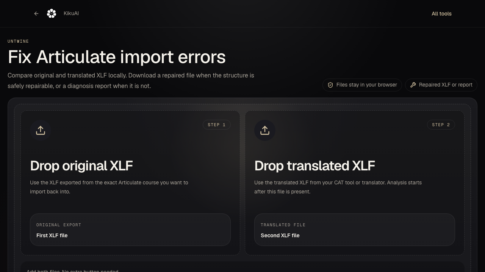

# Untwine

Untwine is a local-first CLI and library for diagnosing and safely repairing Articulate Rise/Storyline XLIFF import failures.

**[Run the demo repair](#quickstart)**

[Docs](#what-is-in-this-repo) · [Examples](#quickstart) · [Safe repairs](#safe-repairs)



Sample output:

```text
Verdict: repairable
Critical issues: 1
Total issues: 2
```

Use it when you exported an original `.xlf`, translated it in a CAT tool, and Articulate refuses to import it back because the translated file no longer matches the course structure.

The tool is intentionally narrow: it does not translate files and it does not promise to fix every XLIFF. It compares the original and translated XLIFF 1.2 files, reports likely import blockers, and only rewrites metadata that can be repaired deterministically without changing translated text.

## Quickstart

```bash
git clone https://github.com/KikuAI-Lab/untwine.git
cd untwine
npm test
```

Analyze a repairable demo file:

```bash
node bin/articulate-xliff-doctor.js analyze \
  demo-files/demo-articulate-original.xlf \
  demo-files/demo-articulate-translated-safe-repair.xlf
```

Expected result:

```text
Verdict: repairable
Critical issues: 1
Total issues: 2
```

The analyzer exits non-zero when it finds critical issues. That is expected for this demo fixture.

Write the repaired file:

```bash
node bin/articulate-xliff-doctor.js repair \
  demo-files/demo-articulate-original.xlf \
  demo-files/demo-articulate-translated-safe-repair.xlf \
  --out demo-files/demo-articulate-translated-safe-repair.repaired.xlf
```

Expected result:

```text
Wrote repaired XLIFF: demo-files/demo-articulate-translated-safe-repair.repaired.xlf
Critical issues after repair: 0
```

If you install or link the package locally, the same CLI is available as `articulate-xliff-doctor`.

```bash
npm link
articulate-xliff-doctor analyze original.xlf translated.xlf --json
```

## What It Catches

- wrong file extension for an XLIFF upload
- malformed XML
- invalid XML entities
- non-XLIFF XML wrappers
- unsupported XLIFF versions
- namespace/version drift between original and translated files
- missing, removed, changed, or mismatched `trans-unit` ids
- missing translated `target` elements
- source/target inline tag count drift
- protected inline tag rewrites
- UTF-8 BOM and XML encoding declaration issues

## Safe Repairs

The current repair engine is conservative. It can safely:

- remove a UTF-8 BOM
- normalize the XML declaration to UTF-8
- restore missing or changed translated `trans-unit` ids when the original and translated unit order still matches

It blocks repairs when the file needs human review or when an automated edit could corrupt translated content.

## Library Usage

```js
import { analyze, repair } from "articulate-xliff-import-doctor";

const files = [
  {
    name: "original.xlf",
    async text() {
      return originalXlfText;
    }
  },
  {
    name: "translated.xlf",
    async text() {
      return translatedXlfText;
    }
  }
];

const preview = await analyze(files);
const repaired = await repair(files);
```

The file objects only need a `name` and either `text()` or `arrayBuffer()`. This makes the core usable in Node, browsers, workers, or local desktop wrappers.

## Privacy Model

The core runs locally and does not upload file content anywhere. The hosted Untwine page keeps the same browser-local boundary.

Hosted tool:
[Untwine - Articulate XLIFF Import Repair](https://kikuai.dev/fix-articulate-xliff-import-error/)

## Limits

- XLIFF 1.2 only.
- Built for Articulate-style original/translated file pairs.
- Not a CAT tool, TMS, translator, or generic XLIFF validator.
- Manual review is still required when target text, inline tags, segmentation, or course structure were materially changed.

## Test Corpus

The repository includes a public proof corpus under `test/articulate-xliff-corpus/` with clean, repairable, manual-review, unrepairable, and unsupported cases.

Run:

```bash
npm test
```

## Research And Visibility Notes

The current product-validation packet lives under `docs/`:

- `docs/research/articulate-xliff-operator-zero-brief-2026-06-12.md` maps the buyer workflow, website-vs-mobile decision, proof corpus coverage, and trial-account blocker.
- `docs/research/articulate-xliff-error-phrase-corpus-2026-06-12.csv` maps public Articulate error phrases to current tool verdicts and detector backlog.
- `docs/marketing/articulate-xliff-import-doctor/` contains the visibility brief, error-page backlog, mention targets, tutorial briefs, outreach drafts, and measurement plan.

## License

AGPL-3.0-only. See [LICENSE](LICENSE).
